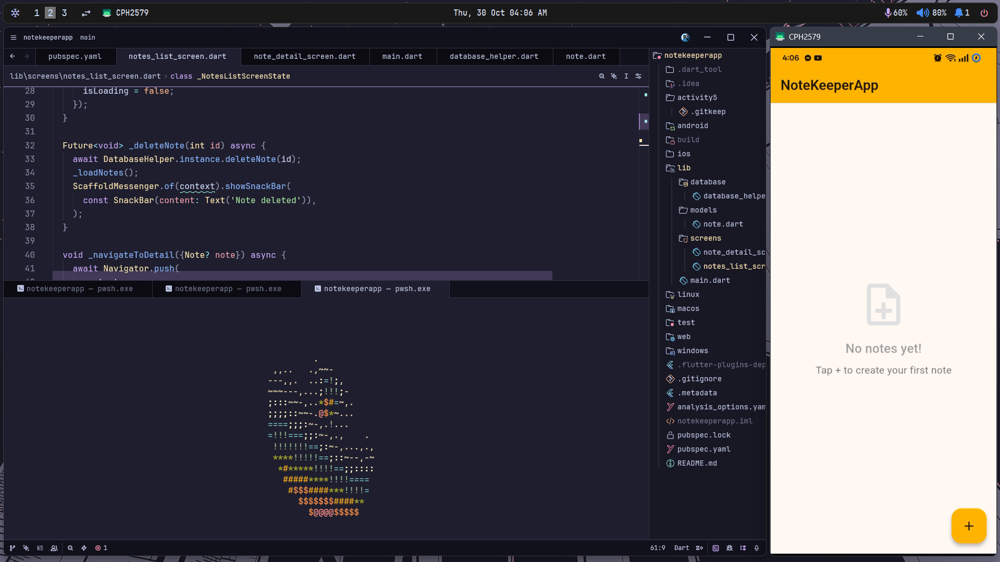
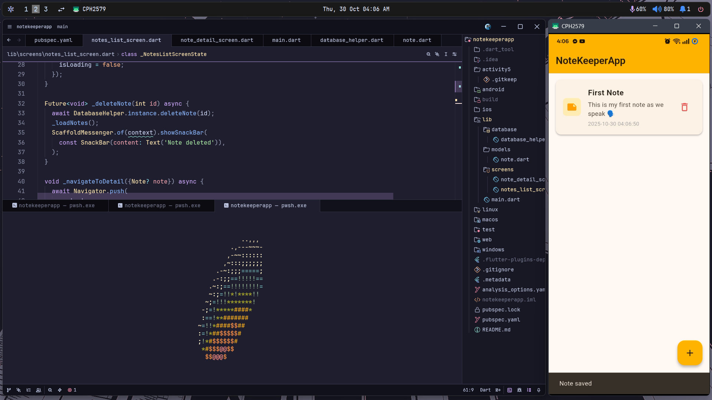
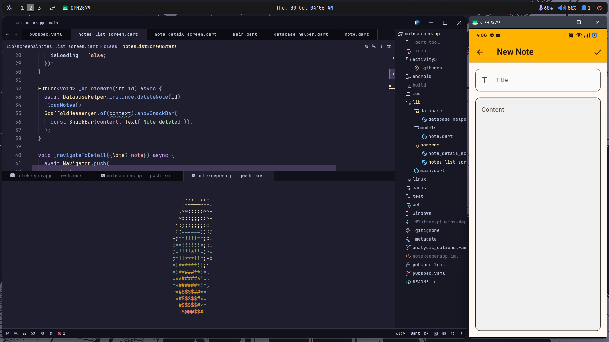
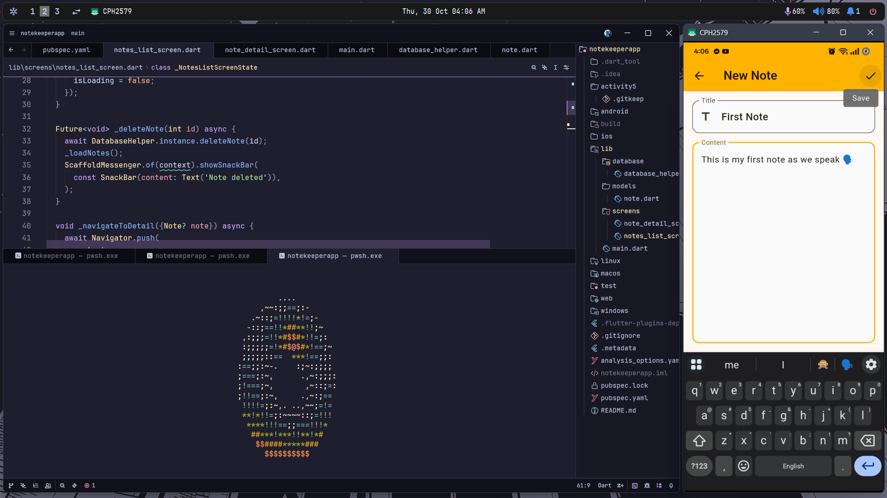
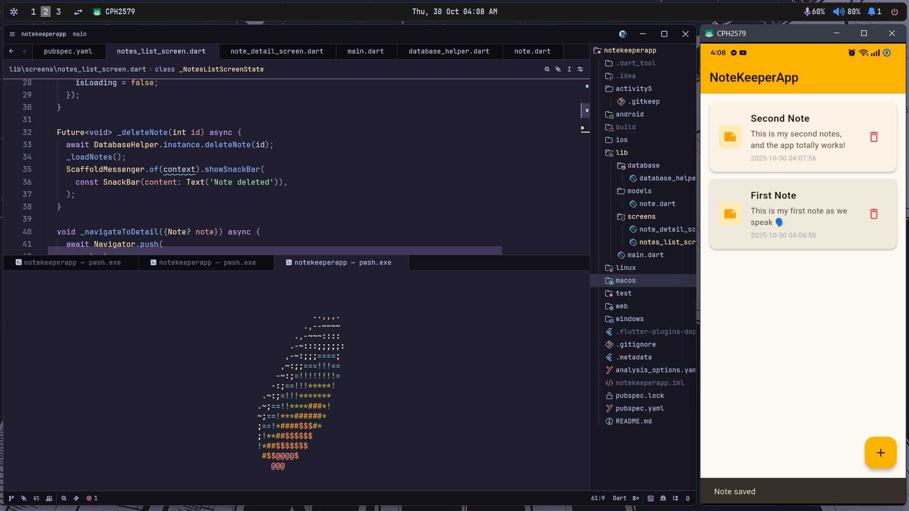
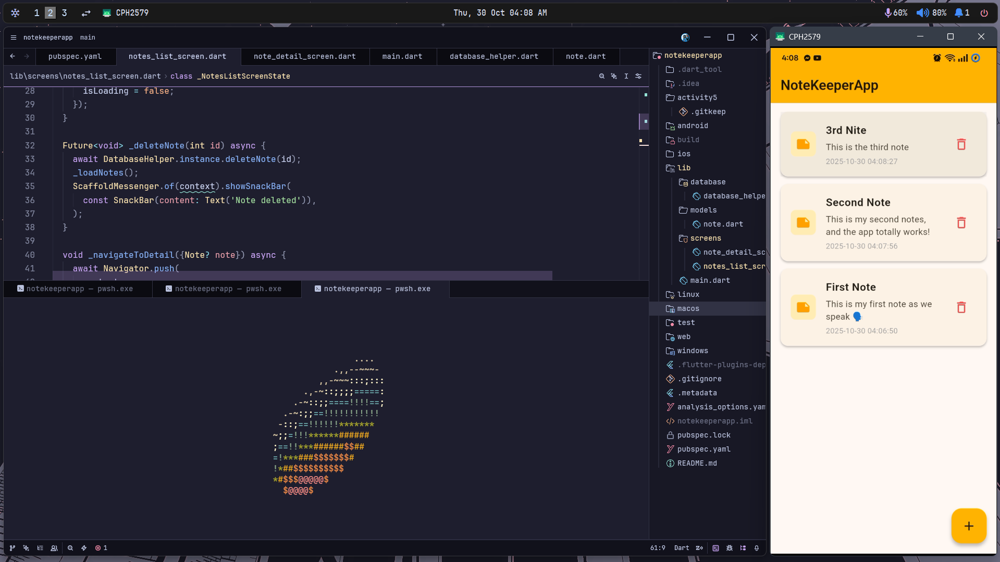
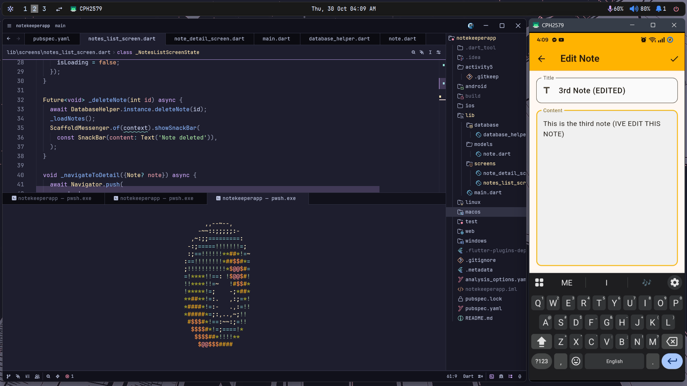
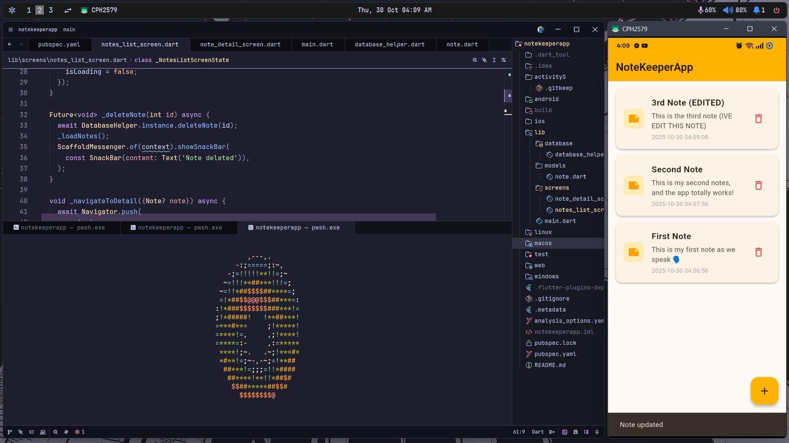
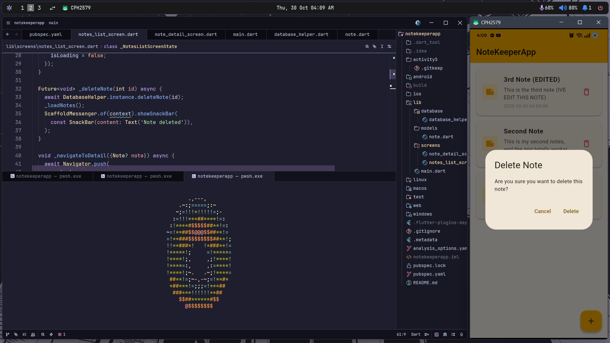
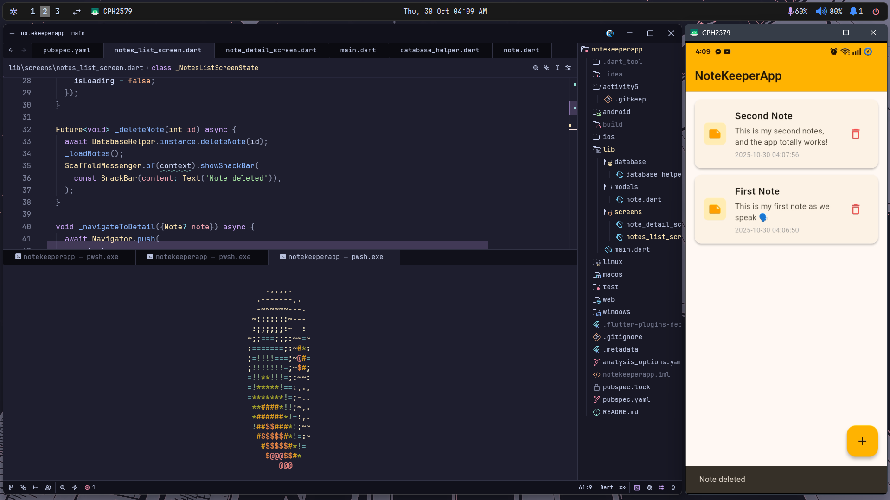

# notekeeperapp

A new Flutter project.

## Getting Started

This project is a starting point for a Flutter application.

A few resources to get you started if this is your first Flutter project:

- [Lab: Write your first Flutter app](https://docs.flutter.dev/get-started/codelab)
- [Cookbook: Useful Flutter samples](https://docs.flutter.dev/cookbook)

For help getting started with Flutter development, view the
[online documentation](https://docs.flutter.dev/), which offers tutorials,
samples, guidance on mobile development, and a full API reference.

## Reflection Questions
- How did you implement CRUD using SQLite?
- What challenges did you face in maintaining data persistence?
- How could you improve performance or UI design in future versions?

## Screenshots
### Empty Notes

### Add Note

### New Note Screen

### New Note Text

### Second Note

### Third Note

### Edit Note

### Update Note

### Delete Note Prompt

### Deleted Note

